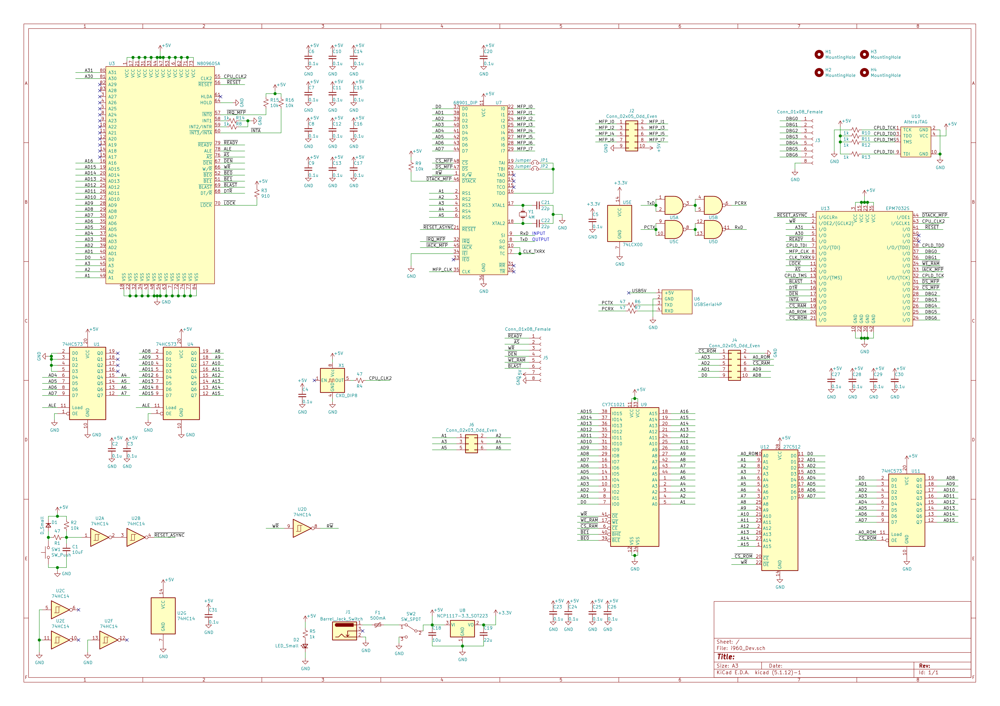

[](https://github.com/nkito/i960_sbc/actions/workflows/docker-image.yml)
[](https://github.com/nkito/i960_sbc/actions/workflows/build-test.yml)

# i960 Single Board Computer

It is a simple simple board computer with a i960 processor. It uses i960SA or i960SB processor which is available as secondhand or an old stock even in today.
Please use it at your own risk.

## Hardware

### Parts

| Functions | Chips |
|----|----|
| Processor                          | Intel i960 working at 16MHz<br>(N80960SA16 w/o FPU or N80960SB16 with FPU) |
| Peripheral (UART, Timer, and GPIO) | Motorola MC68901P |
| Controller                         | Altera EPM7032SLC44-10 <br>(or compatible Atmel ATF1502AS-7JX44) |
| 128 KiB RAM                        | Infineon CY7C1021BN-12ZXC (64K x 16)  |
| 64 KiB ROM                         | 27C512 (64K x 8) with access time below 120ns |

### Schematic

The schematic is [here](schematic/).
Though boards built as the schematic is have been working correctly, there are some points to note related to voltage levels.
* 74HCT573 is better for U1, U4 and U11 instead of 74HC573.
* Generation of RW̅ from WR̅ with a schmitt-trigger inverter 74HC14 might not be a good choice.
* The voltage level for clk2 pin is not the same for the other pins. Please care about clk2.

X1 for clk2 is 32MHz because clock signal for the processor is generated by dividing clk2 in the processor.



### Controller 

Controller sources are placed in [controller folder](controller/).
It can be compiled with Quartus II 64-Bit Version 13.0.1 Build 232 Service Pack 1 Web Edition.

Altera EPM7032S is a discontinued device. Though it can be obtained as secondhand chips, you may obtain locked or broken chips.
Using the compatible Atmel ATF1502AS chip, [Atmel application note 916](http://ww1.microchip.com/downloads/en/AppNotes/DOC0916.PDF), is a good choice.
Atmel tool POF2JED converts a POF file generated with Quartus for Altera EPM7032S into an atmel JED file.
The JED file can be converted into an SVF file with another Atmel tool named ATMISP (Please set "Revision C" as "SVF Version").
A JTAG software such as OpenOCD can program ATF1502AS with the SVF file. 

Some setting is necessary for programming with OpenOCD. Please prepare ``openocd.atf1502as.cfg`` with the following lines.
````
interface usb_blaster

adapter_khz 1000
transport select jtag
jtag newtap ATF1502AS tap -irlen 3 -expected-id 0x0150203f
````
With the configuration file and the SVF file, OpenOCD will program the device.
````
$ openocd -f openocd.atf1502as.cfg -c init -c "svf generated.svf" 
````


## Software

### Cross compiler

A docker container image of cross compiler is available. 

* binutils 2.21.1
* gcc 2.95.3
* newlib 1.8.2

Install from the command line
```
$ docker pull ghcr.io/nkito/i960_sbc:latest
```

Try the command line
```
$ docker run -it --rm ghcr.io/nkito/i960_sbc:latest
```
or the following 
```
$ docker run -it --rm -v /path_to_src_folder_in_host:/src -u (host uid):(host gid) ghcr.io/nkito/i960_sbc:latest
```

Compiler binaries are in /usr/local/cross/bin.

### Sample code

A sample code is [here](sample_hello/). 

